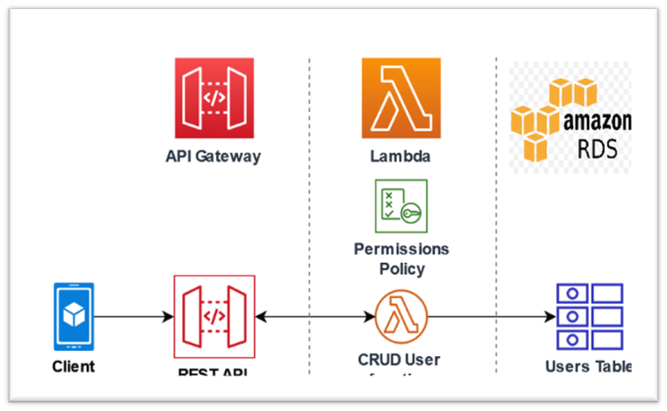
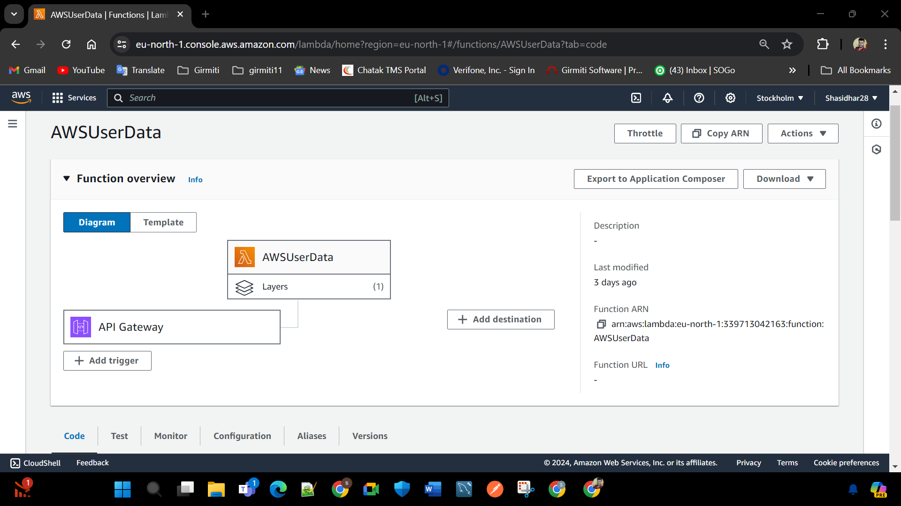
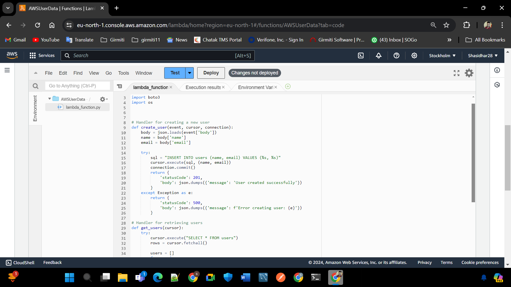
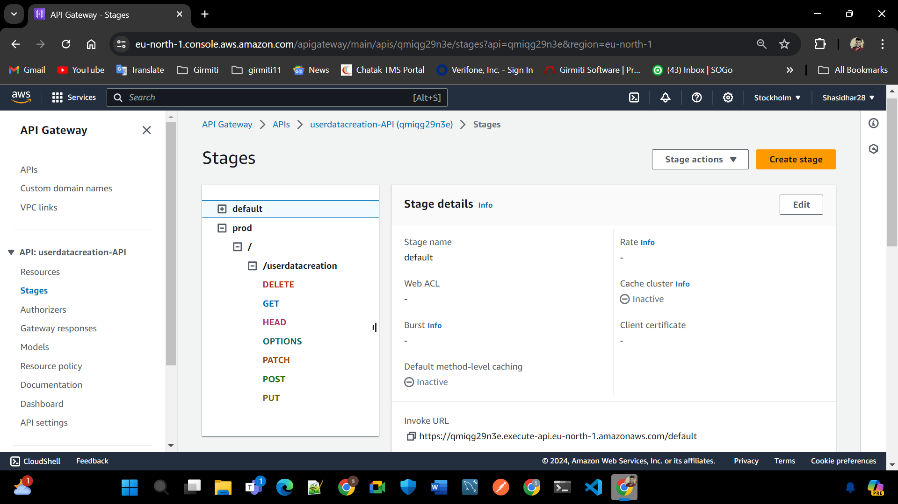

# RESTful API-Driven Data Engineering Platform

## Author

- Name: Sasidhar Naidu
- Roll No: G23AI1034

## Architecture Design

1. `lamdafun.py` script contains lamda funtion to operate RestFulServices

   
   

2. Enable Public API and setup CURD services to the funtion

   

3. Create a PublicAPI point to interact with the lamda funtion

## Acknowledgments

- [lambda](https://docs.aws.amazon.com/lambda/latest/dg/welcome.html)