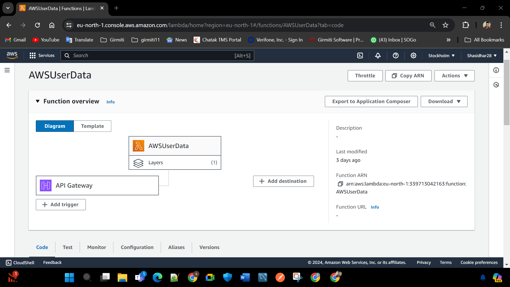
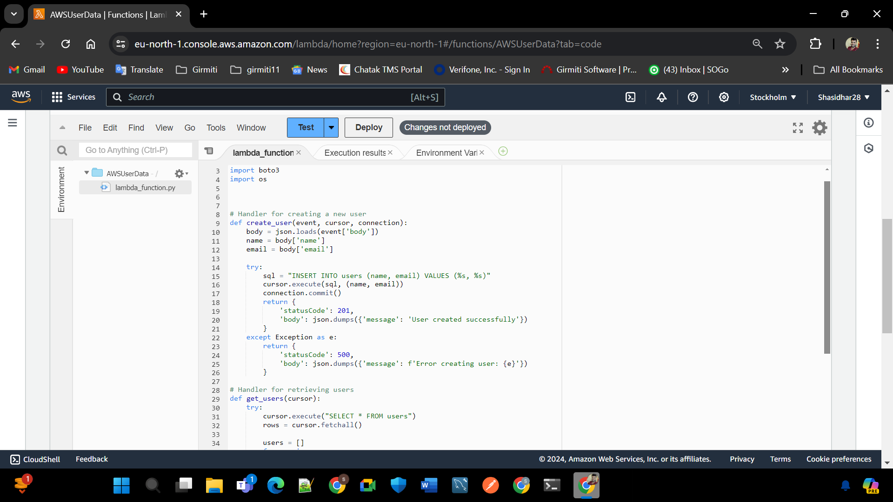
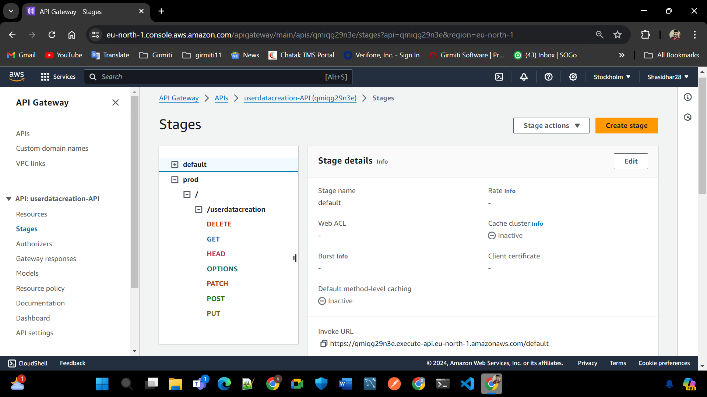
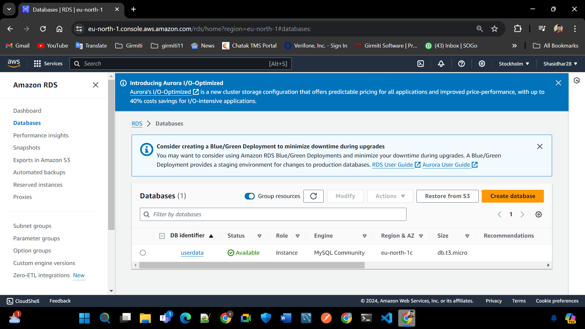
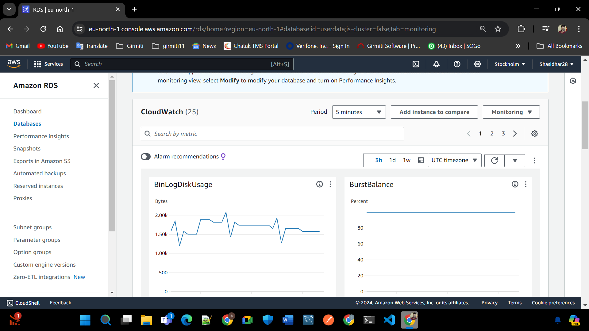

# HealthRDS Monitor Pro (MPRE): A Health Data Management System

## Overview
This project presents "HealthRDS Monitor Pro (MPRE)," a comprehensive system for managing patient data using Amazon RDS, AWS Lambda, REST API, and Streamlit. Amazon RDS provides secure and scalable storage for patient records, while AWS Lambda automates data processing updates on patient movements.

# Author

## Group - 5

- Name: Sasidhar Naidu
- Roll No: G23AI1034

- Name: Bruhathi Reddy
- Roll No: G23AI1009

- Name: Swaroop Magatapalli
- Roll No: G23AI1053

## Architecture Design

#### Data Ingestion

Components: API Gateway, Ingestion Services

API Gateway: Centralized entry point for incoming data.
Ingestion Services: Microservices responsible for different data sources (e.g., batch ingestion, streaming data, real-time data).
Architecture:

External applications and data sources send data to the API Gateway.
The API Gateway routes the data to the appropriate Ingestion Service based on the type and source of the data.
Ingestion Services preprocess the data (e.g., validation, transformation) and forward it to Data Storage.

#### Data Storage
Components: Data Lake, Data Warehouse, Database

Data Lake: Stores raw and unstructured data.
Data Warehouse: Stores structured and processed data.
Database: Operational data storage (e.g., NoSQL, SQL databases).
Architecture:

Ingestion Services push raw data to the Data Lake via RESTful APIs.
Data Processing components pull data from the Data Lake for transformation and processing.
Processed data is stored in the Data Warehouse for analysis and reporting.
Operational databases store data needed for real-time applications.

#### Data Processing
Components: ETL/ELT Pipelines, Processing Engines

ETL/ELT Pipelines: Extract, Transform, Load processes for data transformation.
Processing Engines: Tools like Apache Spark, Flink, or other processing frameworks.
Architecture:

Data Processing services extract data from the Data Lake via RESTful APIs.
Transformation and processing tasks are performed using processing engines.
Processed data is loaded back into the Data Lake or Data Warehouse.

#### Data Aggregation
Components: Aggregation Services, Data Mart

Aggregation Services: Microservices to aggregate and summarize data.
Data Mart: Stores aggregated data for specific business needs.
Architecture:

Aggregation Services fetch data from the Data Warehouse or Data Lake via RESTful APIs.
Data is aggregated and summarized according to business requirements.
Aggregated data is stored in Data Marts for quick access.

#### Data Visualization
Components: Visualization Tools, Dashboard Services

Visualization Tools: Tools like Tableau, Power BI, or custom web applications.
Dashboard Services: RESTful services providing data for dashboards and reports.
Architecture:

Visualization tools pull aggregated data from Data Marts via RESTful APIs.
Dashboard Services provide endpoints for customized data views and analytics.
Users access visualizations through web interfaces or embedded dashboards.

#### RestFul Services

RESTful services form the backbone of our Data Engineering Platform, enabling seamless communication and data management across various components. These services adhere to the principles of Representational State Transfer (REST), providing a stateless, client-server, cacheable, and uniform interface for data operations.

#### StreamLit

Streamlit is an open-source app framework used to create custom web applications for data visualization. It allows data scientists and engineers to turn data scripts into shareable web apps in a matter of minutes, providing an interactive and user-friendly interface for data analysis and visualization.

### Setup

### Create LamdaFuntion 

1. Login into AWS Service and Create a Lamda service
2. use `lamdafun.py` script operate RestFulServices

   
   
   
### API Public Point Setup
1. Add a API Layer to the Lamda Funtion 

   

### Integrate lamda Funtion with Amazon RDS Database
   
1. Login into AWS Service and Create a RDS service
   
   

### Link with webpage UI using StreamLit

1. use `HealthCareManagementSystem.py` script to create StreamLit Application
2. run command "streamlit run `App.py` to run the entire Funtion

## Acknowledgments

- [lambda](https://docs.aws.amazon.com/lambda/latest/dg/welcome.html)
- [Api GateWay](https://docs.aws.amazon.com/apigateway/latest/developerguide/welcome.html)
- [AmazonRDS](https://docs.aws.amazon.com/AmazonRDS/latest/UserGuide/Welcome.html)